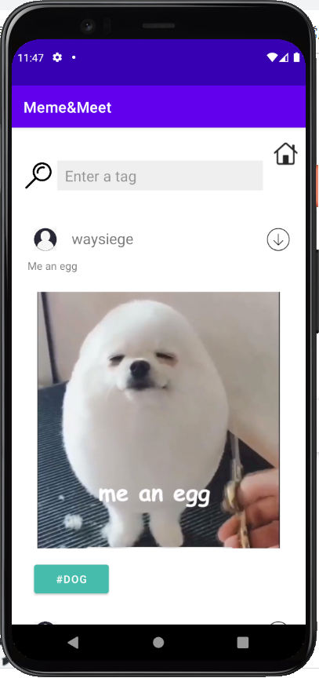
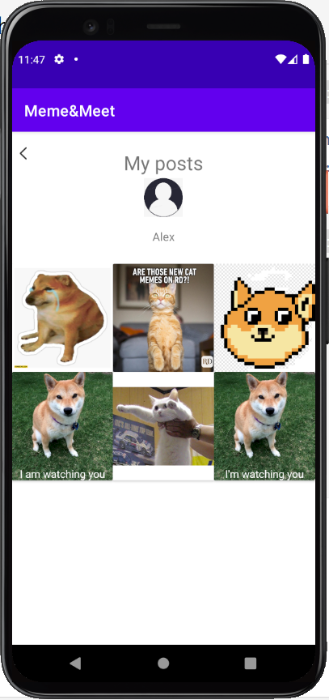
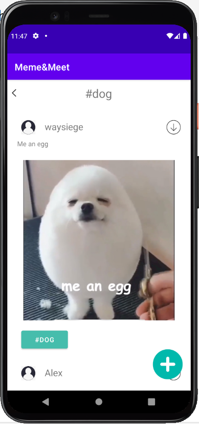
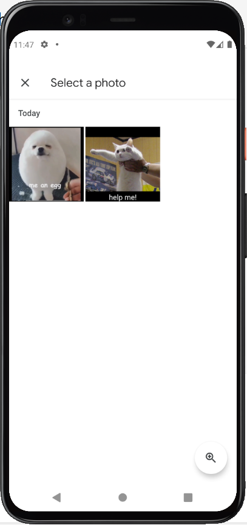
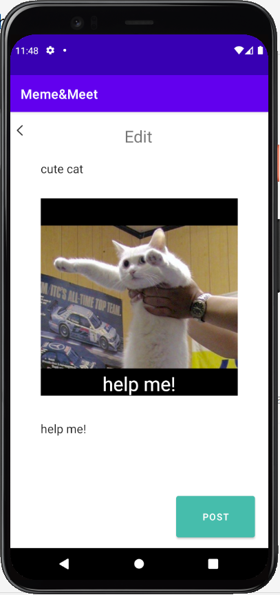

# HackChallenge Final Project: Meme&Meet
Search and post memes

## App name:
Meme&Meet

## App Tagline:
In the application we created, people will be able to search for meme templates, create their own memes, and post memes about the events happening at Cornell. 
Link(s) to any other public GitHub repo(s) of your app: https://github.com/Santiago-Lai/HackChallenge
Some screenshots of your app (highlight important features)

## A short description of your app (its purpose and features)
* Login screen: users can enter their username and click login
* Home screen: users can view a recycler view of available posts and enter text into the search field
* Tag screen: users can view the posts created by other uses under the same tag
* Meme screen: users can upload a picture and add text to the picture to create the meme
* Profile screen: user can see their username and profile picture and a list of memes they have created
* Post screen: user can click in each individual post image and the caption added
* The user first logs in, then goes to the home screen to view posts. If they are interested in a specific category of post, they can search for a tag and see only posts of that tag. Then, they can post in the tag. They can also navigate to the profile screen to view a list of posts they have and click on them to see more information about the individual post. 
For networking, we use GET requests to get the posts from the backend. We also use the POST request when adding a new post. 
A list of how your app addresses each of the requirements

##  Android: (not finished yet)
A completed Recycler View with a custom adapter;
Use of either 3rd party API, networking, or persistent storage;
3 fully functional screens.

## Backend:
7 routes (4 GET, 3 POST)
3 tables in database with a relation between posts and tags, posts and users
Full API specification: https://github.com/Santiago-Lai/HackChallenge/blob/HackChallenge/MemeMeet/backend/README.txt

## Design: (not finished yet)
Low fidelity sketches of design
Medium fidelity explorations of multiple flows in Figma
High fidelity prototype in Figma
UI design kit/design system in Figma

## Screenshots

## Anything else you want your grader to know:
Thank You! You Are the Best!
